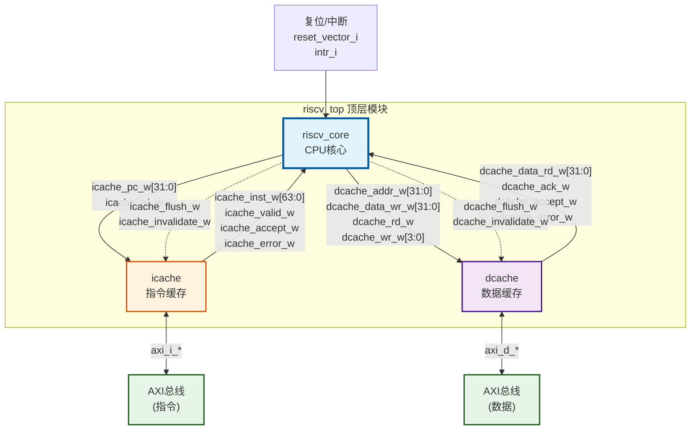
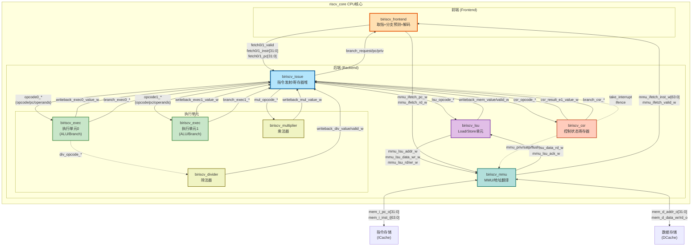
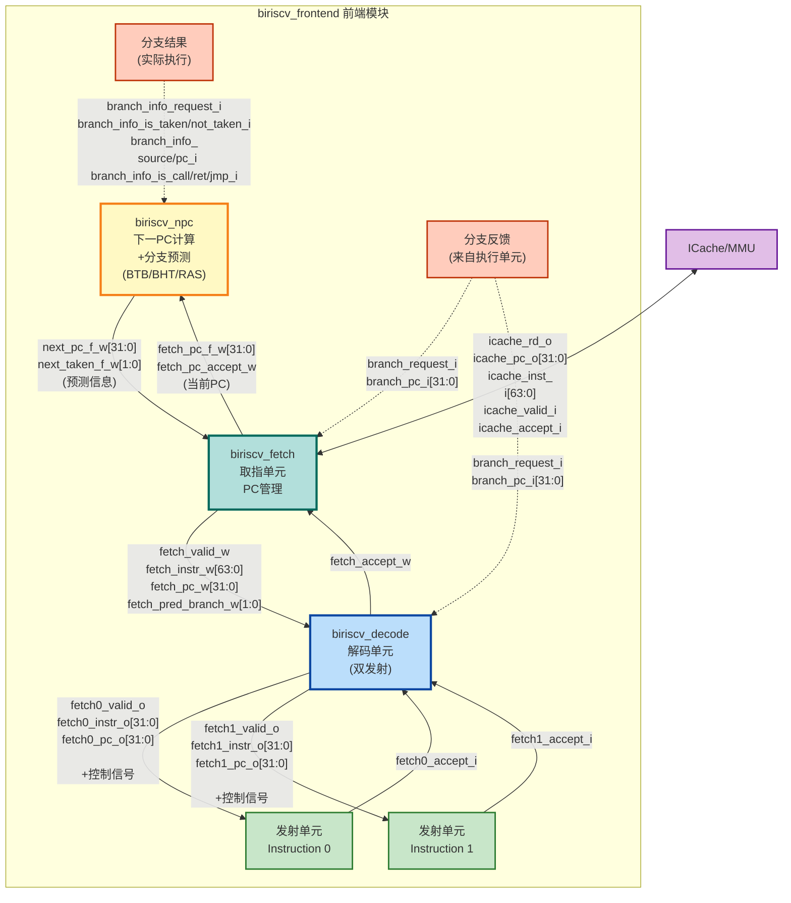

## 分支预测器性能统计

## 基本信息

当 `branch_request_i` 拉高：

- RAS 学习
如果 BTB 命中或者不命中：
- btb_pc_q 更新：`btb_pc_q[btb_wr_entry_r]     <= branch_source_i`
- btb_is_call_q 更新：`btb_is_call_q[btb_wr_entry_r]<= branch_is_call_i`
- btb_is_ret_q 更新：`btb_is_ret_q[btb_wr_entry_r] <= branch_is_ret_i`
- btb_is_jmp_q 更新：`btb_is_jmp_q[btb_wr_entry_r] <= branch_is_jmp_i`

或者没命中，也会记录这些信息：
- btb_pc_q 更新：`btb_pc_q[btb_wr_alloc_w]     <= branch_source_i`
- btb_is_call_q 更新`btb_target_q[btb_wr_alloc_w] <= branch_pc_i`
- btb_is_ret_q 更新：`btb_is_call_q[btb_wr_alloc_w]<= branch_is_call_i`
- btb_is_ret_q 更新：`btb_is_ret_q[btb_wr_alloc_w] <= branch_is_ret_i`
- btb_is_jmp_q 更新：`btb_is_jmp_q[btb_wr_alloc_w] <= branch_is_jmp_i`

总之，只要 `branch_request_i` 拉高，BTB 中一定会记录一个 PC 的情况，这是为了学习。

注意，此时 BTB 中的 `{pc:npc}` 中只有 `btb_pc_q` 更新，`btb_target_q` 并没有更新。只有当 `branch_is_taken_i` 拉高的时候，它才会更新：

```Verilog
if (branch_is_taken_i)
        btb_target_q[btb_wr_entry_r] <= branch_pc_i;
```

其实就算不拉高，相当于也在更新了，因为默认npc = pc+8。只是更新没有意义，考虑到功耗，不用更新了。

当 `branch_is_taken_i` 或者 `branch_is_not_taken_i` 拉高：

- bht_sat_q 就开始饱和计数。

## 性能统计

### 为什么 `branch_request_i` 会拉高呢？

当前端的 issue 部件发现两个指令都不是期望的指令时，这时候就会发射一组信号来修正 npc 部件的 next_pc 生成，这样 refetch 的时候 npc 就会发出正确的 PC，从而 issue 部件拿到期望的指令：

```Verilog
else if (fetch0_valid_i || fetch1_valid_i)
        mispredicted_r = 1'b1;

...
//-------------------------------------------------------------
// Branch predictor info
//-------------------------------------------------------------
// This info is used to learn future prediction, and to correct
// BTB, BHT, GShare, RAS indexes on mispredictions.
assign branch_info_request_o      = mispredicted_r;
assign branch_info_is_taken_o     = (pipe1_branch_e1_w & branch_exec1_is_taken_i)     | (pipe0_branch_e1_w & branch_exec0_is_taken_i);
assign branch_info_is_not_taken_o = (pipe1_branch_e1_w & branch_exec1_is_not_taken_i) | (pipe0_branch_e1_w & branch_exec0_is_not_taken_i);
assign branch_info_is_call_o      = (pipe1_branch_e1_w & branch_exec1_is_call_i)      | (pipe0_branch_e1_w & branch_exec0_is_call_i);
assign branch_info_is_ret_o       = (pipe1_branch_e1_w & branch_exec1_is_ret_i)       | (pipe0_branch_e1_w & branch_exec0_is_ret_i);
assign branch_info_is_jmp_o       = (pipe1_branch_e1_w & branch_exec1_is_jmp_i)       | (pipe0_branch_e1_w & branch_exec0_is_jmp_i);
assign branch_info_source_o       = (pipe1_branch_e1_w & branch_exec1_request_i)      ? branch_exec1_source_i : branch_exec0_source_i;
assign branch_info_pc_o           = (pipe1_branch_e1_w & branch_exec1_request_i)      ? branch_exec1_pc_i     : branch_exec0_pc_i;

```

这意味着如果 `branch_request_i` 拉高，一定是分支预测错误（一定是分支指令，如果不是，就会+8，但是为了万无一失，这里需要 trace 验证），或者是方向，或者是目标；如果 `branch_request_i` 没有拉高，说明预测单元给出的 npc 是正确的，但不意味着此时做出了分支预测（这是必然的，不需要验证）。


因此，一个思路是：

- 判断 PC 对应的指令是分支指令(跳转、call、ret等)的次数 M；
- 统计 branch_request_i 拉高的次数 N。

分支预测正确率就是 `((N/M)*100) %`。


### 问题

经过验证，`branch_request_i` 拉高，它的指令不一定是分支指令。因此结论为：如果 `branch_request_i` 拉高，一定是不期待的指令，但不一定是分支指令。

## 指令流的顺序

首先需要搞清楚 frontend 数据通路。

### riscv_top 顶层架构图

这个顶层包含三个主要模块：icache(指令缓存)、dcache(数据缓存) 和riscv_core(CPU核心)，对外暴露 axi 总线，对内分别连接 icache、dcache。



riscv_core 是一个核心，它包含这些部件：

- biriscv_frontend：
- biriscv_mmu：
- biriscv_lsu：
- biriscv_csr：
- biriscv_multiplier：
- biriscv_divider：
- biriscv_issue：
- biriscv_exec：u_exec0，u_exec1


riscv_core 数据通路说明：
- 前端 → 发射：双指令流 (fetch0/fetch1)
- 发射 → 执行：双发射到两个执行单元 + 乘法器 + LSU + CSR
- 执行 → 写回：所有执行单元的结果写回到 Issue 单元
- 分支控制：执行单元计算分支结果反馈到前端
- 访存通路：通过 MMU 连接到外部存储



## biriscv_frontend

这里有三个内部模块：biriscv_npc、biriscv_decode、biriscv_fetch。

### biriscv_npc

biriscv_npc 的作用是计算 next_pc + 分支预测，将 next_pc_f_o 和 next_taken_f_o 发射到 biriscv_fetch 部件。issue 部件将 npc 反馈信息发到 frontend，最终到达 biriscv_npc。issue 的分支反馈信息来源于 biriscv_exec 执行部件。

### biriscv_fetch

fetch 拿到来自 icache 经过 mmu 处理过的地址的指令后，将：

- fetch_valid_w：
- fetch_instr_w[63:0]:
- fetch_pc_w:

等信号发往 biriscv_decode 单元。

### biriscv_decode

decode 单元拿到这些信号后，对数据进行解析，然后将数据发送到 issue 模块（双发射）。


前端数据通路说明：
- PC 流向：NPC → next_pc_f_w → Fetch → icache_pc_o → ICache
- 指令流向：ICache → icache_inst_i[63:0] → Fetch → fetch_instr_w[63:0] → Decode → fetch0/1_instr_o[31:0]
- 分支预测：NPC 产生预测信息 (next_taken_f_w) → Fetch → Decode
- 分支更新：执行单元分支结果 → branch_info_* → NPC 更新预测器
- 双发射输出：Decode 输出两路指令流 (fetch0/fetch1) 到后端

### reset_pc

reset_pc 这个信号很关键，它是 reset 之后 CPU 的初始 pc。查看源码可以看到，这个 PC 可以配置，也可以通过仿真环境往里面传入，testbench.h：
```C++
#define MEM_BASE 0x80000000
    // Set reset vector
    reset_vector_in.write(MEM_BASE);
```

这个信号传送到 riscv_core --> biriscv_csr：

```Verilog
else if (reset_q)
begin
    branch_target_q <= reset_vector_i;
    branch_q        <= 1'b1;
    reset_q         <= 1'b0;
end
else
begin
    branch_q        <= csr_branch_w;
    branch_target_q <= csr_target_w;
end

assign branch_csr_request_o = branch_q;
assign branch_csr_pc_o      = branch_target_q;
assign branch_csr_priv_o    = satp_reg_w[`SATP_MODE_R] ? current_priv_w : `PRIV_MACHINE;
```
接着这个信号传递到了 issue：

```Verilog
always @ (posedge clk_i or posedge rst_i)
if (rst_i)
    pc_x_q <= 32'b0;
else if (branch_csr_request_i)
    pc_x_q <= branch_csr_pc_i;
else if (branch_d_exec1_request_i)
    pc_x_q <= branch_d_exec1_pc_i;
else if (branch_d_exec0_request_i)
    pc_x_q <= branch_d_exec0_pc_i;
else if (dual_issue_w)
    pc_x_q <= pc_x_q + 32'd8;
else if (single_issue_w)
    pc_x_q <= pc_x_q + 32'd4;
```

reset 结束后的一个周期，branch_csr_request_i 拉高，pc_x_q 就是 传入的 reset_pc。

接着 issue 会发射这组信号发送到前端 frontend：

```Verilog
// Branch request (CSR branch - ecall, xret, or branch misprediction)
// Note: Correctly predicted branches are silent
assign branch_request_o          = branch_csr_request_i | mispredicted_r;
assign branch_pc_o               = branch_csr_request_i ? branch_csr_pc_i : pc_x_q;
assign branch_priv_o             = branch_csr_request_i ? branch_csr_priv_i : priv_x_q;
```

frontend 拿到这组信号后，发射到 decode 和 biriscv_fetch。

decode 拿到 branch_request_i 之后，传给了 fetch_fifo 的 flush，目的是刷掉 fifo，其它两组信号悬空，没被利用。

biriscv_fetch 拿到信号后，传给关建的三个信号：

```Verilog
generate
if (SUPPORT_MMU)
begin
    assign branch_w      = branch_q;
    assign branch_pc_w   = branch_pc_q;
    assign branch_priv_w = branch_priv_q;

    always @ (posedge clk_i or posedge rst_i)
    if (rst_i)
    begin
        branch_q       <= 1'b0;
        branch_pc_q    <= 32'b0;
        branch_priv_q  <= `PRIV_MACHINE;
    end
    else if (branch_request_i)
    begin
        branch_q       <= 1'b1; // key sigs
        branch_pc_q    <= branch_pc_i;
        branch_priv_q  <= branch_priv_i;
    end
    else if (icache_rd_o && icache_accept_i)
    begin
        branch_q       <= 1'b0;
        branch_pc_q    <= 32'b0;
    end
end
```

做一些处理后传给 `frontend` ，然后传给 `MMU`，biriscv_fetch：

```Verilog
//-------------------------------------------------------------
// Outputs
//-------------------------------------------------------------
assign icache_rd_o         = active_q & fetch_accept_i & !icache_busy_w;
assign icache_pc_o         = {icache_pc_w[31:3],3'b0};
assign icache_priv_o       = icache_priv_w;
assign icache_flush_o      = fetch_invalidate_i | icache_invalidate_q;
assign icache_invalidate_o = 1'b0;

assign icache_busy_w       =  icache_fetch_q && !icache_valid_i;

```

同时，`assign pc_f_o = icache_pc_w` 将信号发射到 biriscv_npc，下一个周期 npc 也将会给出 next_pc:

```Verilog
//-------------------------------------------------------------
// PC
//-------------------------------------------------------------
reg [31:0]  pc_f_q;
reg [31:0]  pc_d_q;
reg [1:0]   pred_d_q;

always @ (posedge clk_i or posedge rst_i)
if (rst_i)
    pc_f_q  <= 32'b0;
// Branch request
else if (SUPPORT_MMU && branch_w && ~stall_w)
    pc_f_q  <= branch_pc_w; // reset 拿到 branch_pc_w
else if (!SUPPORT_MMU && (stall_w || !active_q || stall_q) && branch_w)
    pc_f_q  <= branch_pc_w;
// NPC
else if (!stall_w)
    pc_f_q  <= next_pc_f_i; // 之后拿到 npc 传来的 next_pc_f_i
```

## 后端：忽略

## 新的思路
通过前面的分析，现在基本掌握了 briscv frontend 的基本面貌。再次研究一下关于前端以及和前端有关单元的细节，以便于确定最好的思路。

### biriscv_npc

给 fetch 单元发射 next_pc，同时也收到 issue 反馈信息以修正分支预测器。

### biriscv_fetch

在 reset 之后，fetch 单元固定向 npc 请求 next_pc。同时，biriscv_fetch 拿到 next_pc 之后，就以这个 pc 访问 icache/mmu，获取指令字。

### biriscv_decode

decode 拿到指令字之后，就开始解码，这里是组合电路，因此可以抓取 `pc:inst`进行检验。在 decode 中实例化了两个 decoder 单元，它们负责解析指令类型，比如：

```Verilog
assign branch_o =   ((opcode_i & `INST_JAL_MASK) == `INST_JAL)   ||
                    ((opcode_i & `INST_JALR_MASK) == `INST_JALR) ||
                    ((opcode_i & `INST_BEQ_MASK) == `INST_BEQ)   ||
                    ((opcode_i & `INST_BNE_MASK) == `INST_BNE)   ||
                    ((opcode_i & `INST_BLT_MASK) == `INST_BLT)   ||
                    ((opcode_i & `INST_BGE_MASK) == `INST_BGE)   ||
                    ((opcode_i & `INST_BLTU_MASK) == `INST_BLTU) ||
                    ((opcode_i & `INST_BGEU_MASK) == `INST_BGEU);
```


### biriscv_issue

拿到 decode 发来的数据后，这里就可以发送到执行单元了。同时，这里会给 `biriscv_npc` 发送反馈信息以更新 `btb` 或者强化 `bht`。


### 观察波形图

这是双发射架构，因此先研究一个发射单元的数据通路。

### exec0

exec0 <---> issue。来自 issue 发射单元的一组输入信号：

```Verilog
    ,input           opcode_valid_i
    ,input  [ 31:0]  opcode_opcode_i
    ,input  [ 31:0]  opcode_pc_i
    ,input           opcode_invalid_i
    ,input  [  4:0]  opcode_rd_idx_i
    ,input  [  4:0]  opcode_ra_idx_i
    ,input  [  4:0]  opcode_rb_idx_i
    ,input  [ 31:0]  opcode_ra_operand_i
    ,input  [ 31:0]  opcode_rb_operand_i
    ,input           hold_i
```

其中关键的信号是 `opcode_pc_i`，`opcode_opcode_i`。前者是当前 exec0 正在处理的指令的 pc，后者是经过 decode 处理后的译码信息。

完成计算的同时（后）它输出了一组关键的信息用来反馈前端：

```Verilog
    ,output          branch_request_o
    ,output          branch_is_taken_o
    ,output          branch_is_not_taken_o
    ,output [ 31:0]  branch_source_o
    ,output          branch_is_call_o
    ,output          branch_is_ret_o
    ,output          branch_is_jmp_o
    ,output [ 31:0]  branch_pc_o
    ,output          branch_d_request_o
    ,output [ 31:0]  branch_d_pc_o
    ,output [  1:0]  branch_d_priv_o
```

其中以下信息将会延迟一拍返回 issue：

```Verilog
    ,output          branch_request_o
    ,output          branch_is_taken_o
    ,output          branch_is_not_taken_o
    ,output [ 31:0]  branch_source_o
    ,output          branch_is_call_o
    ,output          branch_is_ret_o
    ,output          branch_is_jmp_o
    ,output [ 31:0]  branch_pc_o
```

而这组信号是组合电路产生的，会在本周期内返回 issue：

```Verilog
    ,output          branch_d_request_o
    ,output [ 31:0]  branch_d_pc_o
    ,output [  1:0]  branch_d_priv_o
```

### issue

issue 单元会将以下信息发往到 frontend-->npc：

```Verilog
assign branch_info_request_o      = mispredicted_r;
assign branch_info_is_taken_o     = (pipe1_branch_e1_w & branch_exec1_is_taken_i)     | (pipe0_branch_e1_w & branch_exec0_is_taken_i);
assign branch_info_is_not_taken_o = (pipe1_branch_e1_w & branch_exec1_is_not_taken_i) | (pipe0_branch_e1_w & branch_exec0_is_not_taken_i);
assign branch_info_is_call_o      = (pipe1_branch_e1_w & branch_exec1_is_call_i)      | (pipe0_branch_e1_w & branch_exec0_is_call_i);
assign branch_info_is_ret_o       = (pipe1_branch_e1_w & branch_exec1_is_ret_i)       | (pipe0_branch_e1_w & branch_exec0_is_ret_i);
assign branch_info_is_jmp_o       = (pipe1_branch_e1_w & branch_exec1_is_jmp_i)       | (pipe0_branch_e1_w & branch_exec0_is_jmp_i);
assign branch_info_source_o       = (pipe1_branch_e1_w & branch_exec1_request_i)      ? branch_exec1_source_i : branch_exec0_source_i;
assign branch_info_pc_o           = (pipe1_branch_e1_w & branch_exec1_request_i)      ? branch_exec1_pc_i     : branch_exec0_pc_i;
```

npc 在下一个周期就会完成 BTB、BHT 的更新。

同时 issue 将这个分支信息发送到 decode、fetch 单元。

### 分支预测器的性能表现

首先，当 npc 中的 branch_request_i 的信号拉高的时候，确实是执行单元拿到了不期待的指令。通过观察波形图，当它拉高的时候，有可能是非分支指令。但是当 branch_request_i 拉高的时候，branch_is_taken_i 或者 branch_is_not_taken_i 拉高，那么一定是分支指令出现了跳转错误。

因此，有一个思路是，统计所有的分支指令和 `(branch_request_i && (branch_is_taken_i || branch_is_not_taken_i)` 的次数，这就能判断出分支指令预测的准确率。

所有的分支指令如何统计？只需要将 branch_is_taken_i 和 branch_is_not_taken_i 数据加起来就行了，就这么简单。

最终的结果令人满意（方向、目标正确率暂未实现，整体正确率才有意义）：

```txt
========================================
   Branch Predictor Statistics
========================================

--- Overall Statistics ---
Total Branches:      5560
Total Predictions:   5560

--- Direction Prediction ---
Correct:             5015
Incorrect:           545
Accuracy:            90.20%

--- Target Address Prediction ---
Correct:             5015
Incorrect:           545
Accuracy:            90.20%

--- Overall Prediction (Direction + Target) ---
Correct:             5015
Incorrect:           545
Accuracy:            90.20%

--- Branch Type Distribution ---
Taken:               3596
Not Taken:           1964
Calls:               37
Returns:             1
Jumps:               189
========================================
```


