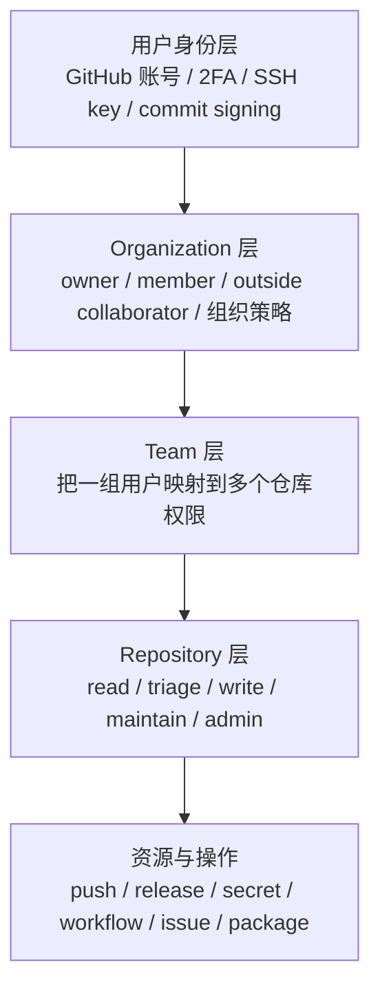
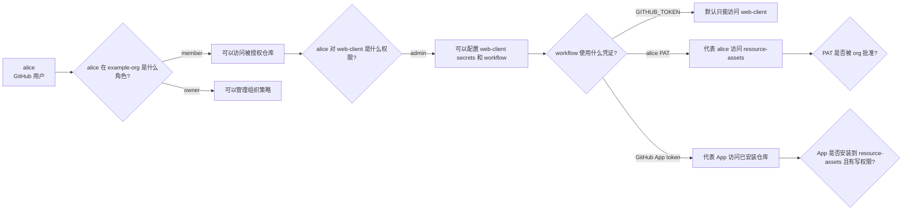

## 〇、前言

我以前看 GitHub 权限的时候，总觉得它应该很简单：

> 我是不是这个组织的 member？  
> 我是不是这个仓库的 admin？  
> 我能不能 push？

后来真正把 GitHub Actions、跨仓库 release、PAT、GitHub App 放到一起用的时候，才发现这个理解太粗了。

GitHub 的安全模型不是一层，而是很多层叠在一起。一个人可能是 organization 的 member，但不能管理 organization 策略；一个人可能是某个仓库的 admin，但不能批准组织级的 fine-grained PAT；一个 workflow 可能在一个仓库里成功运行，但它不能天然写入另一个仓库。

这篇文章先不急着讲 PAT 和 GitHub App，先把 GitHub 最基础的权限结构讲清楚。因为后面很多看起来很玄学的 `403 Forbidden`，其实都能回到一句话：

> 当前这个操作，到底是谁在执行？它想访问哪个资源？它被哪一层权限挡住了？

为了避免绑定真实项目，下面统一使用一个虚构组织和几组示例仓库。

| 名称 | 类型 | 作用 |
|------|------|------|
| `example-org` | Organization | 示例组织 |
| `example-org/web-client` | Repository | 前端或客户端源码仓库 |
| `example-org/resource-assets` | Repository | 公开资源发布仓库 |
| `example-org/backend-service` | Repository | 后端服务仓库 |
| `example-org/docs-site` | Repository | 文档站点仓库 |
| `example-resource-release-bot` | GitHub App | 用于发布资源的机器身份 |

下面所有案例都围绕这些名字展开。

## 一、先建立一个总图

GitHub 权限大概可以拆成四层：



如果只看最下面的仓库权限，很容易误判。

比如 `alice` 对 `example-org/web-client` 有 admin 权限，于是她觉得自己应该能把 `web-client` 的构建产物发布到 `example-org/resource-assets`。但实际上：

- 她对 `web-client` 是 admin，不代表她对 `resource-assets` 也是 admin；
- 她是 `example-org` 的 member，不代表她是 organization owner；
- 她能管理 `web-client` 的 repository secrets，不代表她能批准组织级 PAT；
- 她能修改某个 workflow，不代表这个 workflow 就有跨仓库写权限。

这就是 GitHub 权限里最容易踩坑的地方：**权限不是一个形容词，而是一组关系。**

应该问的是：

```text
谁，用什么身份，对哪个资源，执行什么操作？
```

而不是简单问：

```text
我是不是 member？
```

## 二、用户身份层：账号只是身份，不是完整权限

用户身份层包括：

- GitHub 账号；
- 2FA；
- SSH key；
- GPG 或 SSH commit signing；
- 用户本人的 PAT；
- 用户在不同组织和仓库里的角色。

这里最重要的一点是：

> 用户身份只能说明“你是谁”，不能自动说明“你能做什么”。

举一个例子。`alice` 有一个 GitHub 账号，并且配置了 SSH key：

```text
alice
├── GitHub account
├── 2FA enabled
├── SSH key for git push
└── GPG key for commit signing
```

这些配置能证明 `alice` 是 `alice`，也能让她安全地登录、签名、推送代码。但是当她想操作 `example-org/resource-assets` 时，GitHub 还会继续看：

- `alice` 是不是 `example-org` 的成员？
- `alice` 对 `resource-assets` 有没有权限？
- 这个仓库有没有 branch protection？
- 这个操作是不是被 organization policy 限制？
- 如果使用 token，这个 token 有没有被批准？

所以 GitHub 账号本身不是通行证，它只是第一步。

这和操作系统里的用户有点像。你登录了系统，只说明你通过了认证；你能不能读 `/etc/shadow`，还要看权限位、用户组、sudo 策略等。GitHub 也是一样，登录只是认证，真正能不能操作资源，取决于后面的授权。

## 三、Organization 层：owner 和 member 差距很大

Organization 是 GitHub 权限治理的一个大边界。

在 `example-org` 里，常见角色大概有三种：

| 角色 | 含义 | 典型能力 |
|------|------|----------|
| owner | 组织所有者 | 管成员、策略、安全设置、App 安装、组织 secrets |
| member | 组织成员 | 能访问被授权的仓库和团队资源 |
| outside collaborator | 外部协作者 | 只被授权访问特定仓库，不是组织正式成员 |

需要注意的是，`member` 这个词听起来很大，但在安全治理上其实没有那么大。

比如 `alice` 是 `example-org` 的 member，她可能能看到 `web-client`，也能给 `web-client` 提 PR。但是下面这些事情，她不一定能做：

- 修改 `example-org` 的 PAT 策略；
- 审批其他人的 fine-grained PAT；
- 查看整个组织的 audit log；
- 给所有仓库统一开启 rulesets；
- 安装或批准一个 organization 级 GitHub App；
- 管理 organization secrets。

这些通常是 org owner 或者被授权的安全管理员才能做的事情。

这就是很多问题的源头。比如 `alice` 看到自己是 `example-org` 的 member，又是 `web-client` 的 admin，于是以为自己可以批准一个访问 `resource-assets` 的 fine-grained PAT。结果 GitHub 页面上根本找不到入口，或者 API 调用直接返回 403。

这不是 GitHub 出错了，而是她站错了权限层。

她有的是：

```text
example-org/web-client 的 repo admin
```

但审批组织级 PAT 需要的是：

```text
example-org 的 org owner 权限
```

这两个权限不是一回事。

## 四、Repository 层：repo admin 只管当前仓库

Repository 权限是我们平时最容易接触的权限。

GitHub 常见仓库权限大概是：

| 权限 | 可以做什么 | 适合谁 |
|------|------------|--------|
| read | 读代码、看 issue、看 release | 普通读者、依赖方 |
| triage | 管 issue、PR 标记和分派，但不能 push | 项目协作者 |
| write | push 分支、提交代码、参与开发 | 开发者 |
| maintain | 管理仓库但不能做破坏性设置 | 维护者 |
| admin | 管仓库设置、权限、secrets、部分集成 | 仓库管理员 |

这里也有一个很重要的边界：

> 仓库 admin 是“这个仓库”的 admin，不是整个组织的 admin。

例如：

```text
alice 对 example-org/web-client: admin
alice 对 example-org/resource-assets: read
```

那么 `alice` 可以在 `web-client` 里做很多事情：

- 修改仓库设置；
- 增加 repository secrets；
- 配置 Actions；
- 管理 deploy key；
- 管理 `web-client` 自己的 release。

但是她不能因为自己是 `web-client` 的 admin，就去随便修改 `resource-assets` 的 release。

这句话听起来很显然，但在 Actions 里经常会变得不明显。因为 workflow 是在 `web-client` 里跑的，secret 也是放在 `web-client` 里的，于是人很容易误以为：

> 既然这个 workflow 在 `web-client` 里能跑，那它应该能替 `web-client` 做所有事情。

问题在于，它要操作的是 `resource-assets`。GitHub 会检查目标仓库的权限，而不是只看 workflow 所在仓库。

所以跨仓库自动化一定要把源仓库和目标仓库分清楚：

```text
源仓库: example-org/web-client
目标仓库: example-org/resource-assets
动作: 在目标仓库创建或更新 release
```

这样一拆，就会发现这不是一个“当前仓库内部自动化”的问题，而是一个“跨仓库写入”的问题。

## 五、Team 层：把人和仓库权限批量连接起来

如果组织里只有两三个人，直接给仓库加 collaborator 也能凑合用。但是一旦仓库和人多起来，就应该使用 team。

例如 `example-org` 可以有这些 team：

| Team | 成员 | 仓库权限 |
|------|------|----------|
| `frontend-team` | 前端开发者 | `web-client: write` |
| `release-team` | 发布维护者 | `resource-assets: maintain` |
| `backend-team` | 后端开发者 | `backend-service: write` |
| `docs-team` | 文档维护者 | `docs-site: write` |
| `security-team` | 安全负责人 | 多仓库安全治理权限 |

Team 的价值不是“看起来更正规”，而是它减少了权限漂移。

比如一个同学加入前端组，只需要加到 `frontend-team`，就自动获得 `web-client` 的 write 权限；他离开前端组时，从 team 里移除即可，而不用一个仓库一个仓库排查。

权限治理里最怕的是这种状态：

```text
这个人三个月前为了临时修 bug 被加到了某个仓库，
后来没人记得这件事，
但他的权限一直留在那里。
```

Team 的好处就是把“临时加人”变成“按职责授权”。

## 六、仓库权限还会被保护规则继续限制

仓库权限不是最后一层。即使你有 write 或 admin，branch protection、rulesets、required checks 仍然可能继续限制你。

比如 `alice` 对 `example-org/web-client` 有 write 权限，但 `main` 分支开启了保护：

- 禁止 direct push；
- 要求 PR review；
- 要求 CI 通过；
- 要求 commit signed；
- 限制谁能 push；
- 限制 force push 和删除分支。

那么 `alice` 直接推送 `main` 时仍然可能失败。

这不是因为她没有 write 权限，而是因为 `main` 上还有更具体的规则。

可以把它理解成这样：

```text
仓库权限: 你有没有进入这个房间的资格
分支保护: 你进入房间之后，能不能动这个保险柜
```

Actions 也是一样。假设 `web-client` 的发布流程是：

```text
push main
→ GitHub Actions 构建资源
→ 发布到 resource-assets
```

那么保护 `web-client/main`，本质上就是保护发布流水线。因为谁能把代码合进 `main`，谁就可能影响后续自动发布出来的资源。

## 七、一个 403 应该怎么拆

遇到 `403 Forbidden` 的时候，我现在一般不会先猜 token 坏了，而是先画一个小表。

假设错误发生在 `web-client` 的 workflow 中：

```text
Resource not accessible by integration
HTTP 403
```

可以这样拆：

| 问题 | 示例答案 |
|------|----------|
| 谁在执行？ | `web-client` 的 GitHub Actions job |
| 用什么身份？ | `GITHUB_TOKEN`、`alice` 的 PAT，或者 `example-resource-release-bot` |
| 访问哪个资源？ | `example-org/resource-assets` |
| 做什么操作？ | 创建 release、上传 asset、修改 tag |
| 当前身份对目标仓库有什么权限？ | read、write、admin，还是没有安装 |
| 是否被组织策略限制？ | PAT pending、App 未批准、ruleset 拦截 |
| 是否被事件类型限制？ | fork PR、`pull_request_target`、environment approval |

这张表比单纯看报错更有效。

因为 GitHub 的报错有时候比较抽象，尤其是在 Actions 里，`403` 可能代表很多种事情：

- token 没有目标仓库权限；
- token 有权限，但被组织策略拦住；
- workflow 事件来自 fork，secret 没有注入；
- `GITHUB_TOKEN` 只对当前仓库有效；
- GitHub App 没安装到目标仓库；
- GitHub App 安装了，但没给 Contents write；
- 分支、tag 或 ruleset 不允许当前操作。

只要把“身份、资源、动作、策略”这四件事拆开，大部分问题都会变得清楚。

## 八、一个完整例子

现在我们看一个完整一点的例子。

目标是：`example-org/web-client` 在 `main` 分支更新后，自动构建资源包，并发布到 `example-org/resource-assets`。

直觉上可能会这样想：

```text
web-client 是组织里的仓库
resource-assets 也是组织里的仓库
我也是组织 member
所以 Actions 应该能发过去
```

但实际权限链路应该这样看：



如果 workflow 用的是 `GITHUB_TOKEN`，它默认主要作用于 `web-client`，不能天然写 `resource-assets`。

如果 workflow 用的是 `alice` 的 fine-grained PAT，那么它代表的是 `alice`，并且访问 `example-org` 资源时可能需要组织 owner 批准。

如果 workflow 用的是 `example-resource-release-bot` 的 installation token，那么它代表的是 GitHub App。只要这个 App 已安装到 `resource-assets`，并且有 Contents write 权限，就可以执行发布。

同一个操作，换了身份，权限链路就完全不同。

这就是为什么 GitHub 安全不是“我是不是 member”这么简单。

## 九、实用检查清单

以后设计一个 GitHub 自动化流程时，可以先问这些问题：

1. 源仓库是谁？比如 `example-org/web-client`。
2. 目标仓库是谁？比如 `example-org/resource-assets`。
3. 触发事件是什么？比如 `push main`、`workflow_dispatch`、`release`。
4. workflow 运行时使用什么凭证？`GITHUB_TOKEN`、PAT，还是 GitHub App token？
5. 这个凭证代表谁？用户、当前仓库的 Actions App，还是自定义 GitHub App？
6. 这个身份对目标仓库有什么权限？
7. 这个身份是否被 organization 策略限制？
8. `main`、tag、release 是否有 branch protection 或 rulesets？
9. secrets 放在哪个作用域？repository、environment，还是 organization？
10. 谁能修改 workflow？workflow 修改是否需要 review？

这些问题看起来麻烦，但它们能提前挡住很多后面的安全事故。

## 十、结论

GitHub 的权限模型不是一个简单的开关，而是身份、组织、团队、仓库、分支保护、组织策略共同叠出来的结果。

一个人是 `example-org` 的 member，不代表他能管理组织策略；一个人是 `web-client` 的 repo admin，不代表他能写 `resource-assets`；一个 workflow 能在源仓库跑起来，也不代表它能访问目标仓库。

所以以后看到权限问题，可以先不要急着改 token。先把问题拆成：

```text
谁在执行？
用什么身份？
访问哪个资源？
执行什么动作？
被哪一层策略限制？
```

下一篇就进入真正的程序化访问：Classic PAT、fine-grained PAT、`GITHUB_TOKEN` 和 GitHub App。它们看起来都是 token，但背后的身份模型完全不同。

## 参考资料

- GitHub 权限级别文档：[Repository roles for an organization](https://docs.github.com/en/organizations/managing-user-access-to-your-organizations-repositories/repository-roles-for-an-organization)
- GitHub 组织角色文档：[Roles in an organization](https://docs.github.com/en/organizations/managing-peoples-access-to-your-organization-with-roles/roles-in-an-organization)
- GitHub rulesets 文档：[About rulesets](https://docs.github.com/en/repositories/configuring-branches-and-merges-in-your-repository/managing-rulesets/about-rulesets)
- GitHub protected branches 文档：[About protected branches](https://docs.github.com/repositories/configuring-branches-and-merges-in-your-repository/managing-protected-branches/about-protected-branches)
