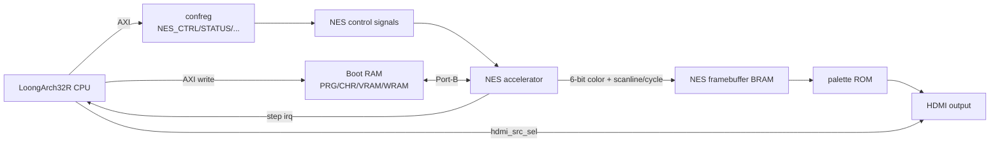

前面几篇主要在软件侧做 NES：先移植 LiteNES，再尝试用 JIT 减少 6502 解释器的开销。但软件模拟始终有一个绕不开的问题：原本 NES 的 CPU、PPU、调色板、扫描线、手柄移位寄存器都是硬件并行工作的；放到软核 CPU 上解释执行以后，这些并行行为都变成了串行函数调用。

所以本项目又做了一条硬件路线：把 Verilog NES 核包装成 SoC 外设，让 LoongArch32R 软核负责加载 ROM、配置寄存器和处理输入，而真正的 NES CPU/PPU 执行、像素生成由 FPGA 逻辑完成。

这不是给 LoongArch CPU 加一条专用指令，也不是把软件模拟器某个函数硬化，而是更像一个可控协处理器：

```text
LoongArch32R/xOS 负责：加载 ROM、写控制寄存器、切 HDMI 源、写手柄状态
NES 硬件核负责：6502 执行、PPU 时序、像素颜色输出
HDMI 模块负责：把 NES framebuffer 或 DDR framebuffer 输出到屏幕
```

## 总体结构

本项目里的 NES 硬件加速路径主要涉及这些文件：

| 路径 | 作用 |
|------|------|
| `IP/nes/src/nes.v`、`cpu.v`、`ppu.v`、`apu.v` | NES 硬件核心 |
| `IP/nes/nes_accel_top.v` | 项目侧封装：运行控制、单步、手柄、SRAM bridge |
| `IP/nes/nes_sram_bridge.v` | 把 NES 8 位地址访问映射到 SoC Boot RAM 的 32 位端口 |
| `IP/nes/nes_fb_bram.v` | NES 像素帧缓冲，6-bit indexed color |
| `IP/nes/nes_palette_rom.v` | 6-bit NES 调色板索引到 RGB 的查表 |
| `IP/CONFREG/confreg_a7lite.v` | NES 控制寄存器和中断寄存器 |
| `SoC/top/soc_top.v` | 顶层连接：Boot RAM Port-B、HDMI 源选择、中断映射 |
| `bsp/include/nes.h`、`bsp/src/nes.c` | 软件侧 BSP 控制接口 |
| `software/xos_pro_max/src/shell.c` | `mario` 命令：加载 ROM 并启动硬件 NES |
| `software/nes_test/main.c` | NES 控制寄存器测试程序 |

从系统图看，大致是这样：



## 为什么要挂在 Boot RAM 上

NES ROM 至少包含 PRG ROM 和 CHR ROM。对于最常见的 NROM/Mapper 0 游戏，PRG 最大 32KB，CHR 最大 8KB，再加上 VRAM/WRAM，80KB 以内可以放下。项目里 Boot RAM 实例参数就是 80KB：

```verilog
soc_axi_sram_bridge #(
    .RAM_SIZE       (81920),
    .RAM_ADDR_WIDTH (15),
    .DATA_WIDTH     (32)
) u_boot_rom (
    ...
    .ram_b_ren   (nes_ram_ren),
    .ram_b_raddr (nes_ram_raddr),
    .ram_b_rdata (nes_ram_rdata),
    .ram_b_waddr (nes_ram_waddr),
    .ram_b_wdata (nes_ram_wdata),
    .ram_b_wen   (nes_ram_wen)
);
```

CPU 通过 AXI 访问 Boot RAM，把 ROM 数据写进去；NES 核通过 Boot RAM 的 Port-B 读取 PRG/CHR/VRAM/WRAM。这样不用再给 NES 单独做一套 ROM 初始化链路，软件也能很方便地换游戏、清空 VRAM、写测试程序。

项目约定 NES 数据从 Boot RAM 偏移 `0x00000400` 开始，避开前面启动代码区域：

```text
Boot RAM base: 0x2000_0000
NES base offset: 0x0000_0400

NES compact memory:
  PRG  : +0x00000 ~ +0x07FFF  32KB
  CHR  : +0x08000 ~ +0x09FFF   8KB
  VRAM : +0x0A000 ~ +0x0A7FF   2KB
  WRAM : +0x0A800 ~ +0x0AFFF   2KB
```

`nes_sram_bridge.v` 中也能看到对应映射：

```verilog
// PRG  : 0x000000 - 0x007FFF -> 0x0000 - 0x7FFF
// CHR  : 0x200000 - 0x201FFF -> 0x8000 - 0x9FFF
// VRAM : 0x300000 - 0x3007FF -> 0xA000 - 0xA7FF
// WRAM : 0x380000 - 0x3807FF -> 0xA800 - 0xAFFF
```

这里的左侧是 NES 核内部使用的线性地址空间，右侧是压缩后的 Boot RAM 偏移。桥接模块把 NES 的 8 位读写转成 32 位 SRAM 字访问，并根据 byte lane 生成写使能。

## 控制寄存器设计

NES 控制寄存器挂在 confreg 的 `0x1fd0_f080` 起始区域：

| 地址 | 名称 | 方向 | 作用 |
|------|------|------|------|
| `0x1fd0_f080` | `NES_CTRL` | RW | pause/run/step、reset、清标志、中断使能 |
| `0x1fd0_f084` | `NES_STATUS` | RO | step_done、irq_pending、mode、running |
| `0x1fd0_f088` | `NES_START_PC` | RW | 起始 PC，写入后置 valid |
| `0x1fd0_f08c` | `NES_FREQ` | RW | NES clock enable 分频 |
| `0x1fd0_f090` | `NES_MAPPER` | RW | mapper flags |
| `0x1fd0_f094` | `NES_JOYPAD` | RW | 8 位手柄状态 |

`NES_CTRL` 的位定义：

```text
[1:0] mode
      00 = pause
      01 = run
      10 = step，写入即触发一次单步
[2]   reset
[3]   clear_start_pc_valid
[4]   step_irq_enable
[5]   clear_step_done/irq
```

`confreg_a7lite.v` 将这些寄存器转换成硬件控制信号：

```verilog
assign nes_mode           = nes_ctrl_reg[1:0];
assign nes_reset          = nes_ctrl_reg[2];
assign nes_start_pc       = nes_pc_reg;
assign nes_start_pc_valid = nes_pc_valid_reg;
assign nes_ce_div         = nes_ce_div_reg;
assign nes_mapper_flags   = nes_mapper_reg;
assign nes_joypad         = nes_joypad_reg;
assign nes_irq            = nes_irq_reg;
```

单步完成中断被接到 SoC 的硬件中断 bit3：

```verilog
assign interrupt = {4'b0, nes_irq, ps2_int, uart0_int, 1'b0};
```

这让 NES 硬件核不仅能“跑起来”，还可以被软件暂停、单步和调试。对毕业设计来说，这一点很关键：它证明硬件加速模块不是一块黑盒，而是纳入了 SoC 的寄存器、中断和软件驱动体系。

## NES accelerator 封装

`nes_accel_top.v` 是硬件加速模块的项目侧顶层。它主要做四件事：

1. 按 `nes_ce_div` 生成 NES clock enable；
2. 根据 `nes_mode` 实现暂停、连续运行和单步；
3. 把 `NES_JOYPAD` 寄存器转换成 NES 原机手柄的 strobe/shift 行为；
4. 实例化 NES 核和 `nes_sram_bridge`。

运行控制逻辑如下：

```verilog
wire mode_run = (nes_mode == 2'b01);
assign nes_running = mode_run || step_active;

wire nes_ce = (mode_run || step_active) ? ce_tick : 1'b0;
wire nes_reset_out = reset | nes_reset;
```

`NES_FREQ` 写入的是 clock enable 分频值。BSP 里给出了从 62.5MHz `aclk` 推导 NES CPU 频率的宏：

```c
#define BSP_NES_ACLK_HZ     62500000UL
#define BSP_NES_CPU_HZ(div) (BSP_NES_ACLK_HZ / (3u * ((div) + 1u)))
```

其中 `div=11` 时大约是 1.736MHz，接近 NTSC NES 的 CPU 频率。`div=0` 时频率约 20.833MHz，可以作为“加速跑”模式，但这已经不是严格原速。

单步逻辑利用 NES CPU 内部导出的 `cpu_instr_start`。写 `mode=step` 后，封装模块启动 `step_active`，观察到下一条指令边界后停止，并拉高 `nes_step_done`：

```verilog
if (nes_step_req && !step_active) begin
    step_active     <= 1'b1;
    step_seen_start <= 1'b0;
end
if (step_active && cpu_instr_start) begin
    if (!step_seen_start) begin
        step_seen_start <= 1'b1;
    end else begin
        step_active     <= 1'b0;
        step_seen_start <= 1'b0;
        nes_step_done   <= 1'b1;
    end
end
```

这里不是按固定周期单步，而是按 6502 指令边界单步，因此更适合调试 CPU 执行流。

## 起始 PC 覆盖

正常 NES 会从复位向量 `$FFFC/$FFFD` 读取起始 PC。但硬件调试时，经常希望直接让 NES CPU 从某个地址开始执行，例如从 `$8000` 跑一个最小测试程序。

项目里没有改 NES 核内部 MMU，而是在 `nes_sram_bridge.v` 里对复位向量读做覆盖：

```verilog
wire vector_hit = nes_read_cpu && nes_start_pc_valid &&
                  (nes_addr == 22'h003FFC || nes_addr == 22'h003FFD ||
                   nes_addr == 22'h007FFC || nes_addr == 22'h007FFD);

wire [7:0] vector_data = nes_addr[0] ? nes_start_pc[15:8] : nes_start_pc[7:0];
```

软件写 `NES_START_PC` 后，`nes_start_pc_valid` 置位。复位时如果 NES 核读取复位向量，桥接模块返回软件指定的 PC。等 reset 完成后，软件可以通过 `NES_CTRL[3]` 清掉 valid，让后续读向量恢复正常 ROM 内容。

这个设计很小，但解决了硬件调试里一个非常实用的问题：不用改 ROM，也能控制硬件 NES 的入口。

## ROM 加载流程

`xOS Pro Max` 的 shell 中有一个 `mario` 命令，负责加载 ROM 并启动硬件 NES。核心函数是 `nes_hw_load_rom()`：

1. 检查 iNES 文件头 `"NES\x1A"`；
2. 读取 PRG/CHR block 数量；
3. 目前只接受 Mapper 0；
4. 将 PRG 拷贝到 Boot RAM 的 PRG 区；
5. 如果是 16KB PRG，则镜像到第二个 16KB；
6. 将 CHR 拷贝到 CHR 区，或在 CHR RAM 情况下清零；
7. 清空 VRAM/WRAM；
8. 根据 mapper、mirroring、PRG/CHR 大小生成 `mapper_flags`。

实际启动流程在 `cmd_mario()` 中：

```c
nes_hw_load_rom((const uint8_t *)rom_mario_nes, rom_mario_nes_len, &mapper_flags);

hdmi_enable(1);
hdmi_set_source(HDMI_SOURCE_NES);

bsp_nes_init();
bsp_nes_set_mode(BSP_NES_MODE_PAUSE);
bsp_nes_set_freq(BSP_NES_DIV_NTSC_APPROX);
bsp_nes_set_mapper_flags(mapper_flags);
bsp_nes_set_joypad(0);
bsp_nes_set_start_pc(0x8000);

bsp_nes_set_reset(1);
delay_cycles(2000);
bsp_nes_set_reset(0);
delay_cycles(2000);
bsp_nes_clear_start_pc_valid();

bsp_nes_set_mode(BSP_NES_MODE_RUN);
```

这段流程把软件和硬件的边界分得很清楚：软件负责“装弹”和“按启动键”，硬件负责真正运行。

## HDMI 输出路径

NES 核输出的是 6 位颜色索引，而不是软件帧缓冲里的 RGB565 或 ARGB32。项目里给 HDMI 顶层加了一个 NES 专用 framebuffer 写口：

```verilog
.nes_fb_wr_clk  (aclk),
.nes_fb_wr_en   (nes_fb_wr_en),
.nes_fb_wr_addr (nes_fb_wr_addr),
.nes_fb_wr_data (nes_fb_wr_data),
```

SoC 顶层根据 NES 的扫描线和 cycle 生成写地址：

```verilog
assign nes_fb_wr_en   = nes_ppu_ce && (nes_scanline < 9'd240) && (nes_cycle < 9'd256);
assign nes_fb_wr_addr = {nes_scanline[7:0], nes_cycle[7:0]};
assign nes_fb_wr_data = nes_color;
```

这个地址映射很漂亮，因为 NES 原始分辨率正好是 256x240。横坐标和纵坐标各取 8 位，拼起来就是 framebuffer 地址，不需要乘法器。

`nes_fb_bram.v` 是双时钟 BRAM：写端在 `aclk`/NES 侧，读端在 HDMI 像素时钟侧。读出的 6 位颜色索引再经过 `nes_palette_rom.v` 转成 RGB。HDMI 模块通过 `hdmi_src_sel` 在普通 DDR framebuffer 和 NES framebuffer 之间切换：

```text
hdmi_src_sel = 0: 显示 DDR framebuffer，给 shell、PPT、软件绘图用
hdmi_src_sel = 1: 显示 NES framebuffer，给硬件 NES 输出用
```

软件侧对应命令是：

```text
hdmisrc ddr
hdmisrc nes
```

运行 `mario` 时，shell 会自动调用 `hdmi_set_source(HDMI_SOURCE_NES)`；退出后再切回 DDR framebuffer。

## 手柄输入

NES 原机手柄是串行移位读取。硬件封装里用两个 8 位移位寄存器模拟：

```verilog
if (joypad_strobe) begin
    joypad_bits <= nes_joypad;
    joypad_bits2 <= 8'h00;
end
if (!joypad_clock[0] && last_joypad_clock[0])
    joypad_bits <= {1'b0, joypad_bits[7:1]};
```

软件只需要不断写 `NES_JOYPAD` 这一个 8 位状态寄存器。`shell.c` 中把 PS2 键盘映射成 NES 按键：

| 键盘 | NES |
|------|-----|
| W/A/S/D | 上/左/下/右 |
| J | A |
| K | B |
| U | Select |
| I | Start |
| ESC/Q | 退出 Mario 命令 |

这样硬件 NES 仍然保持原机的 strobe/clock 输入模型，但软件接口变成了更简单的“写一个 joypad bitmap”。

## BSP 接口

为了不让应用直接散写裸地址，项目提供了 `bsp/include/nes.h` 和 `bsp/src/nes.c`：

```c
void bsp_nes_init(void);
void bsp_nes_set_mode(bsp_nes_mode_t mode);
void bsp_nes_step_once(void);
void bsp_nes_set_reset(int on);
void bsp_nes_set_freq(uint16_t div);
void bsp_nes_set_start_pc(uint16_t pc);
void bsp_nes_clear_start_pc_valid(void);
void bsp_nes_irq_enable(int on);
void bsp_nes_set_mapper_flags(uint32_t flags);
void bsp_nes_set_joypad(uint8_t state);
uint32_t bsp_nes_read_status(void);
void bsp_nes_clear_step_irq(void);
void bsp_nes_wait_step_done(void);
```

`bsp_nes_step_once()` 里维护了一个 `nes_ctrl_shadow`，避免写 step 这种脉冲控制位时破坏 reset、mode、irq enable 等常驻配置：

```c
uint32_t val = (nes_ctrl_shadow & ~NES_CTRL_MODE_MASK) | NES_CTRL_MODE_STEP;
NES_CTRL_REG = val;
nes_ctrl_shadow = val & (NES_CTRL_MODE_MASK | NES_CTRL_RESET | NES_CTRL_STEP_IRQ_EN);
```

这个小细节很重要。硬件寄存器里既有电平型控制位，也有写 1 触发的脉冲位；软件如果每次临时拼寄存器，很容易误清状态。

## 测试程序

`software/nes_test/main.c` 是硬件控制接口的最小测试。它向 PRG 区写一个很短的 6502 程序：

```text
SEI
CLD
LDX #$00
STX $2000
JMP $8007
```

然后依次测试：

1. 写 `NES_START_PC = 0x8000`；
2. 设置 `NES_FREQ`；
3. 使能单步中断；
4. reset/release；
5. 单步执行 3 次；
6. 切到 run 模式；
7. pause；
8. 再单步 1 次；
9. 清除 start_pc_valid。

这类测试不依赖完整游戏画面，适合验证寄存器、reset、step、irq 和 Boot RAM 映射是否正常。等基础控制路径可靠后，再用 `mario` 命令验证完整 ROM 加载、PPU 输出、HDMI 显示和键盘输入。

## 当前限制

这条硬件路线已经把“NES 作为 SoC 外设运行”打通了，但还不是完整商用级 NES 主机：

1. ROM 加载器当前只支持 Mapper 0；
2. Boot RAM 容量和 compact memory layout 主要面向 NROM 游戏；
3. 音频 `sample` 已从 NES 核导出，但当前文章关注的视频/输入主路径，没有展开音频输出；
4. 起始 PC 覆盖是为了调试和可控启动，完整运行时仍应尽量遵循 ROM 自身复位向量；
5. HDMI NES framebuffer 采用简单 BRAM 输出，还可以继续做缩放、居中和更完整的时序处理。

## 小结

软件 JIT 的价值在于证明自研 SoC 上可以动态生成并执行 LoongArch32R 机器码；硬件 NES 加速的价值则更直接：把原本由软件模拟的 NES CPU/PPU 放回 FPGA 并行逻辑里，让 LoongArch CPU 退回到“系统控制器”的角色。

从毕业设计角度看，这部分可以支撑论文里的三个层次：

1. **总体设计**：LoongArch32R SoC + DDR/Boot RAM + HDMI + confreg 外设；
2. **硬件加速模块设计**：NES 核封装、SRAM bridge、控制寄存器、单步中断；
3. **系统验证**：`nes_test` 验证寄存器控制，`mario` 验证 ROM 加载、HDMI 输出和键盘输入。

后续如果继续完善，优先方向应该是扩展 Mapper、把 ROM 从 SD 卡动态加载、完善音频输出，以及给 NES framebuffer 增加更灵活的显示缩放。到这里，项目已经从“软件模拟 NES”推进到了“在自研 SoC 上挂载一个可控的 NES 硬件加速外设”。
