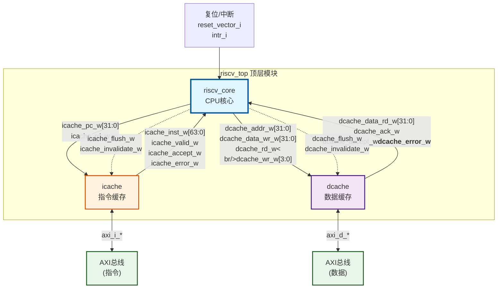

## this is a test

```mermaid
graph TB
      subgraph riscv_top["riscv_top 顶层模块"]
          direction TB

          Core["riscv_core<br/>CPU核心"]
          ICache["icache<br/>指令缓存"]
          DCache["dcache<br/>数据缓存"]

          %% 指令通路
          Core -->|"icache_pc_w[31:0]<br/>icache_rd_w"| ICache
          ICache -->|"icache_inst_w[63:0]<br/>icache_valid_w<br/>icache_accept_w<br
  />icache_error_w"| Core

          %% 数据通路
          Core -->|"dcache_addr_w[31:0]<br/>dcache_data_wr_w[31:0]<br/>dcache_rd_w<
  br/>dcache_wr_w[3:0]"| DCache
          DCache -->|"dcache_data_rd_w[31:0]<br/>dcache_ack_w<br/>dcache_accept_w<b
  r/>dcache_error_w"| Core

          %% 控制信号
          Core -.->|"icache_flush_w<br/>icache_invalidate_w"| ICache
          Core -.->|"dcache_flush_w<br/>dcache_invalidate_w"| DCache
      end

      %% 外部接口
      AXI_I["AXI总线<br/>(指令)"]
      AXI_D["AXI总线<br/>(数据)"]
      RST["复位/中断<br/>reset_vector_i<br/>intr_i"]

      ICache <-->|"axi_i_*"| AXI_I
      DCache <-->|"axi_d_*"| AXI_D
      RST --> Core

      style Core fill:#e1f5ff,stroke:#01579b,stroke-width:3px
      style ICache fill:#fff3e0,stroke:#e65100,stroke-width:2px
      style DCache fill:#f3e5f5,stroke:#4a148c,stroke-width:2px
      style AXI_I fill:#e8f5e9,stroke:#1b5e20,stroke-width:2px
      style AXI_D fill:#e8f5e9,stroke:#1b5e20,stroke-width:2px
```

