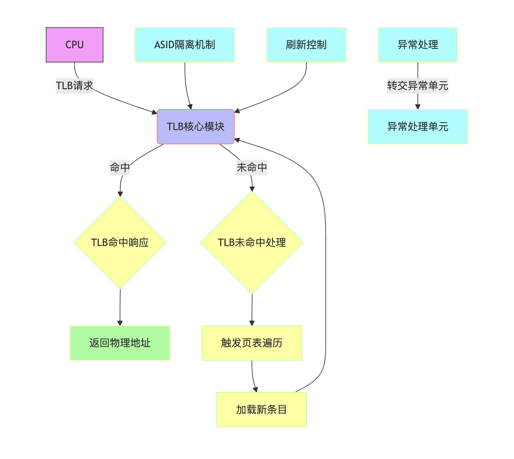

# **高性能RISC-V处理器核“香山”微架构UT验证——ITLB模块**

## **1. 申请人信息**
- **姓名**：路亮
- **联系方式**：
  - 电话：+86 132-0187-3683
  - 邮箱：luliangplus@qq.com
  - GitHub：https://github.com/Luyoung0001
  - 个人技术博客：https://blog.luliang.online/

---

## **2. 项目标题**
**高性能RISC-V处理器核“香山”微架构UT验证——ITLB模块**

---

## **3. 项目概要**

### 搭建 ITLB 模块的验证环境

基于PyTest测试框架进行验证，由于 “万众一芯” 提供了非常详细的测试步骤、工具、依赖等等，因此 ITLB 的验证环境几乎没有任何工作量。

### 划分功能点和测试点

[项目](https://gitlink.org.cn/XS-MLVP/UnityChipForXiangShan/issues/11) 目前给了 14 个功能标识符以及对应的 14 个 功能点，但是一个功能点可能要经过多个测试点来测试。

比如 **REQ_HANDLING** 功能标识符的功能点是 **TLB 接收请求**，我本人在初次尝试测试这个功能点时，发现需要测试的有：

- Requestor0 Verification
- Requestor1 Verification
- Requestor0 和 Requestor1 都发请求
- Requestor2 Verification（阻塞请求）
- ...

一个功能点，就至少需要 4 个测试函数。在测试点上必须做到周到、全面，而这个离不开专业素养。

### 写测试脚本

首先要理解 RTL 的 Wrapper ，这是测试框架的核心。这个 Wrapper 可以利用现有的工具可以直接生成，因此我只需要把注意力放在：
- 阅读 RTL 源码（必要的情况下）
- 阅读 ITLB 的说明文档
- 阅读 Wrapper 中的函数、类

当熟悉上述之后，就可以针对性的对测试点进行测试。

### 验证报告以及测试点表格

“万众一芯”给了很好的模板，因此后期完成所有测试后，就可以按照模板以及提供的规范写验证报告以及测试点表格了。

---

## **4. 对社区的贡献**
**4.1 技术价值**
- 提供开源的 ITLB 验证代码
- 提供详细的测试点
- 提交覆盖率收敛最佳实践文档

**4.2 生态建设**
- 在 GLCC 社区分享芯片验证的经验
- 推动 RISC-V 生态验证工具链完善
- 在学校、网站、论坛分享我的这次经验以及推广 “万众一芯”，并给出最佳实践路线

---

## **5. 实施方案**
### **5.1 技术理解**
**ITLB 核心验证点（暂时的理解）：**
1. **REQ_HANDLING**
   - 验证请求解析逻辑的完整性（读/写/执行类型识别）
   - 检查异常请求（无效地址/非法操作）的错误处理路径

2. **MISS_HANDLING**
   - 验证页表遍历流程的正确性（权限检查、缺页处理）
   - 确认TLB更新机制（新条目加载、旧条目淘汰）

3. **HIT_HANDLING**
   - 验证TLB命中响应的延迟和准确性（物理地址返回、权限验证）
   - 检查多并发访问场景下的数据一致性

4. **PERM_CHECK**
   - 验证权限位与操作类型匹配逻辑
   - 检查权限违规时的异常触发机制

5. **EXCEP_HANDLING**
   - 验证Page Fault/TLB异常上报的完整性
   - 确认异常处理状态机的正确性

---

### **5.2 技术架构**

---

### **5.3 关键技术**
1. **PLRU替换算法**
2. **ASID隔离实现**
3. **压缩技术**

---

## **6 实施规划**
| 里程碑                | 时间          | 目标                                                                 |
|-----------------------|---------------|-------------------------------------------------------------------------|
| 需求规格分析          | 1~2周      | 阅读 ITLB 文档、Wrapper 文件，有必要看代码                             |
|   TLB接收请求   | 3~4周内      | 高清架构图、模块划分方案、RTL代码库（含Testbench）                     |
| TLB miss处理	        | 3~4周内      | 测试点并进行测试                 |
| TLB hit处理 | 3~4周内      | 测试点并进行测试                 |
| 替换策略          | 并行进行     | 测试点并进行测试                          |
| TLB缓存大小	         | 4~5周内      | 测试点并进行测试                         |
| TLB压缩	         | 4~5周内      | 测试点并进行测试                         |
| 刷新	         | 4~5周内      | 测试点并进行测试                         |
| Reset	         | 5~6周内      | 测试点并进行测试                       |
| 权限检查	         | 5~6周内      | 测试点并进行测试                    |
| 异常处理	         | 5~6周内      | 测试点并进行测试                       |
| 隔离	         | 6~7周内      | 测试点并进行测试                |
| 并行访问	         | 6~7周内      | 测试点并进行测试                    |
| 大小页支持		         | 6~7周内      | 测试点并进行测试                         |
| 原型系统验证报告	         | 7~10周内      | 原型系统验证报告                         |
| 测试点表格		         | 7~10周内      | 原型系统验证报告                         |
| 最后的补充	         | 7~10周内      | 完结                         |

---

## **6. 个人简介**
### **6.1 相关经验**
- **(2023~现在)** 西安邮电大学硬件协会
  - 学习“一生一芯”，做到 SoC(使用 Chisel、SystemVerilog)
  - 开发基于 RISC-V32 的 CPU、SoC(使用 Verilog、SystemVerilog)
  - 开发基于 MIPS32 CPU、SoC，并写了一个简单的 OS（模仿一生一芯中的 yieldOS）在上面运行成功
  - 独自一人参加2025年龙芯杯（LA 挑战赛，正在做 Cache）
  - 熟悉 QEMU、NEMU。曾在 QEMU 上跟着视频实现过基于 RISC-V 的 简单的OS。

- **开源贡献**
  - 参与翻译 RISC-V 手册 [中文版](https://github.com/YSYX-OpenDoc/riscv-isa-manual)

### **6.2 技术能力**
- 熟练使用 SystemVerilog、Verilog、Chisel
- 掌握 Verilator、Makefile
- 掌握 C++11、C、Python 等
- 熟悉计算机体系结构
